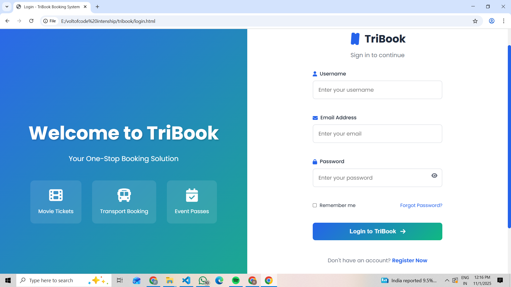
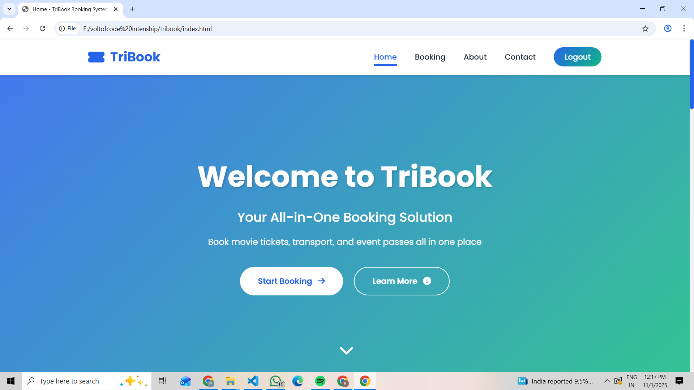
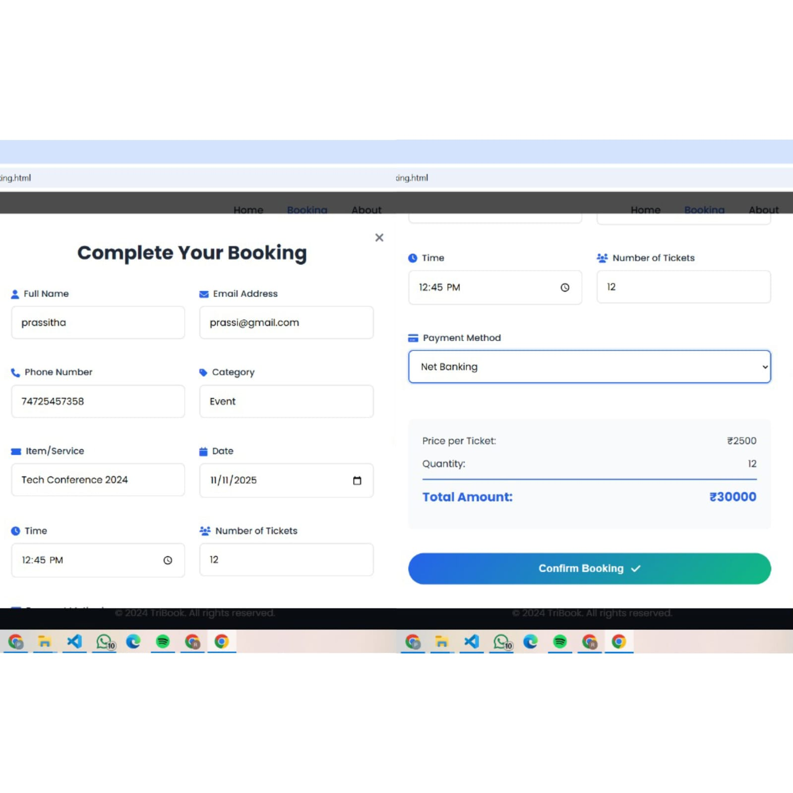
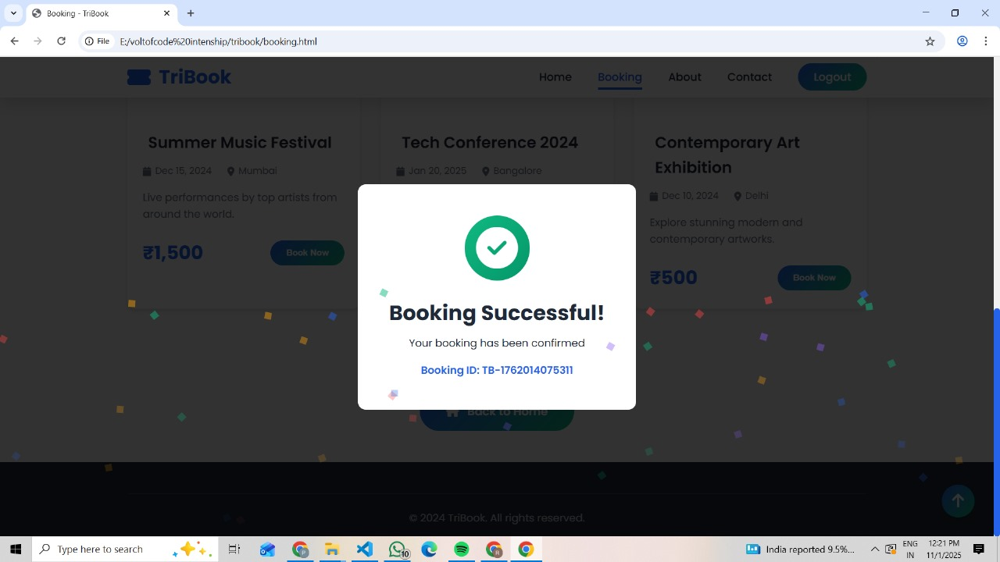
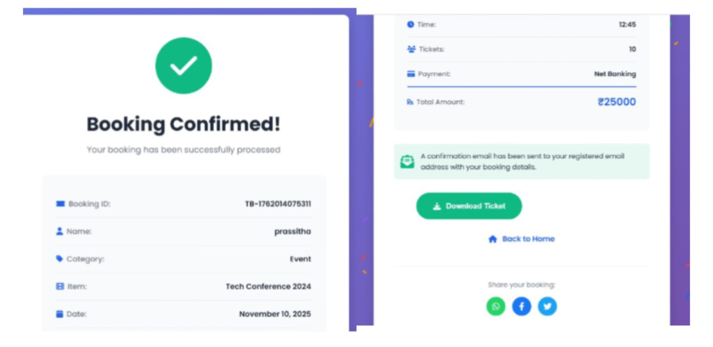
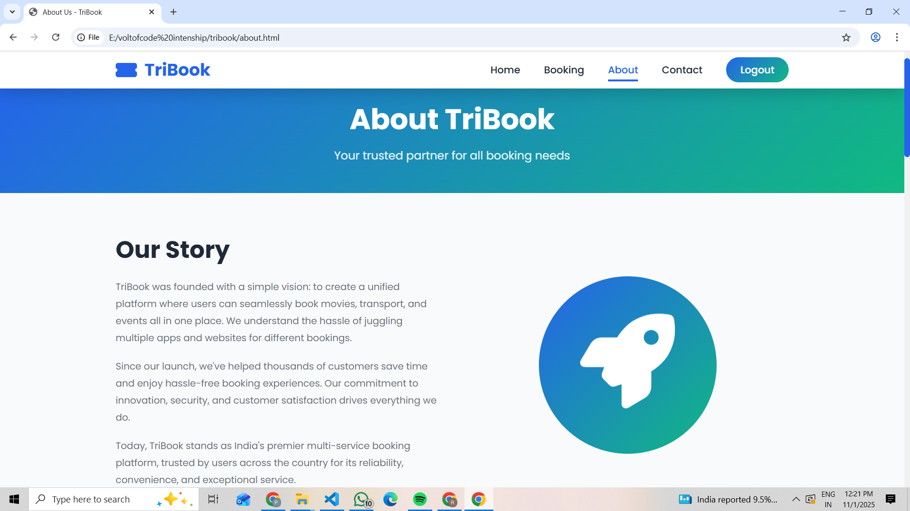
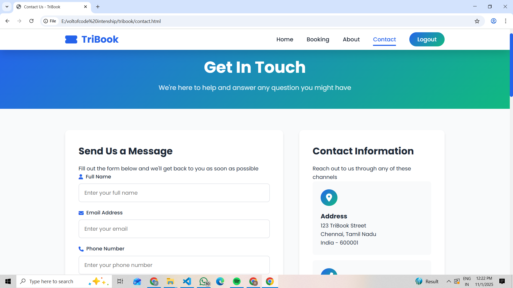
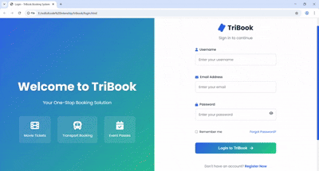

# 🎫 TriBook - Multi-Service Online Booking System

[]()
[]()
[]()

## 📖 About The Project

**TriBook** is a comprehensive web-based booking platform that consolidates three major booking services into one unified system:

- 🎬 **Movie Ticket Booking**
- 🚌 **Transport Booking** (Bus, Train, Flight)
- 🎉 **Event Pass Booking** (Concerts, Exhibitions, Fests)

### Problem Statement
Users currently need multiple apps and websites for different booking needs, leading to:
- Time wastage switching between platforms
- Multiple login credentials to manage
- Inconsistent user experiences
- Scattered booking history

### Our Solution
TriBook provides a **single, unified platform** with:
- ✅ One login for all services
- ✅ Consistent user interface
- ✅ Centralized booking management
- ✅ Simplified payment process

---

## 🌟 Features

### Core Features
- **User Authentication**: Secure login system with form validation
- **Responsive Design**: Works seamlessly on desktop, tablet, and mobile
- **Three Booking Categories**: Movies, Transport, Events
- **Dynamic Content**: Category tabs with real-time switching
- **Modal Booking Form**: Clean popup interface for bookings
- **Real-time Price Calculation**: Automatic total calculation based on quantity
- **Booking Confirmation**: Success page with confetti celebration
- **LocalStorage Integration**: Client-side data persistence
- **Search & Filter**: Find bookings quickly
- **Social Sharing**: Share bookings on social media

### Additional Features
- Animated gradient backgrounds (no external images required)
- Smooth hover effects and transitions
- FAQ section with accordion
- Contact form with character counter
- Back to top button
- About page with team information
- Mobile-responsive hamburger menu

---

## 📸 Screenshots

### Login Page

*Modern login interface with background image and tabbed navigation*

### Home Page

*Hero section with animated stats and category showcase*

### Booking Page

*Dynamic booking interface with category tabs and search*

### My Bookings Page

*Complete booking management with filters and statistics*

### Confirmation Page


*Success celebration with confetti and ticket details*
### About page


### Contact Page

*Contact form with FAQ accordion and map*

---


## 🚀 Live Demo

[View Live Demo]  

---

## 🎞️ Presentation

You can view or download the official project presentation below:

📄 [Download TriBook Presentation (PPTX)](./TriBook_Presentation.pptx)

---


## 🛠️ Built With

- **HTML5** - Structure and semantic markup
- **CSS3** - Styling, animations, and gradients
- **JavaScript (ES6+)** - Functionality and interactivity
- **Font Awesome 6.4.0** - Icons
- **Google Fonts (Poppins)** - Typography

---

## 📁 Project Structure
```
tribook-booking-system/
│
├── index.html              # Home page (after login)
├── login.html              # Login page (entry point)
├── booking.html            # Booking page with categories
├── confirm.html            # Confirmation page
├── about.html              # About page
├── contact.html            # Contact page
│
├── css/
│   └── style.css          # Complete stylesheet
│
├── js/
│   └── script.js          # All JavaScript functionality
│
├── images/                # Optional image folder
│   └── (gradients used instead)
│
└── README.md              # This file
```

---

## 🔧 Installation & Setup

### Prerequisites
- Any modern web browser (Chrome, Firefox, Safari, Edge)
- A code editor (VS Code, Sublime Text, etc.) - optional
- No server or database required (frontend-only)

### Steps to Run Locally

1. **Clone the repository**
```bash
   git clone https://github.com/prassi05/tribook-booking-system.git
```

2. **Navigate to project directory**
```bash
   cd tribook-booking-system
```

3. **Open in browser**
   - Simply open `login.html` in your web browser
   - Or use Live Server extension in VS Code
```bash
   # If using VS Code with Live Server
   Right-click on login.html → Open with Live Server
```

4. **Start using the application**
   - Enter any username, email, and password (demo mode)
   - Click "Login to TriBook"
   - Explore the booking system!

---

## 💻 Usage

### Login
1. Open `login.html` in your browser
2. Enter any credentials (no validation in demo mode):
   - Username: demo
   - Email: demo@example.com
   - Password: password123
3. Click "Login to TriBook"

####  Home Page 
- Hero section with animated background
- Interactive category showcase cards
- "Why Choose Us" feature grid
- "How It Works" step-by-step guide
- Customer testimonials carousel
- Call-to-action section
- Statistics counter animation

### Book a Service
1. On the home page, click "Book Now" on any service card
2. Or navigate to "Booking" page from the menu
3. Select category: Movies, Transport, or Events
4. Click "Book Now" on your desired item
5. Fill in the booking form:
   - Personal details
   - Date and time
   - Number of tickets
   - Payment method
6. Click "Confirm Booking"

### View Confirmation
- See your booking details
- Download ticket (demo)
- Share on social media
- Book another or return home

#### About Page 
- Company mission and vision
- "How It Works" timeline
- Team member profiles
- Company statistics
- Service highlights
- Interactive animations

#### Contact Page 
- Contact information cards with icons
- Contact form with validation
- Character counter (max 500)
- FAQ accordion section
- Google Maps integration
- Success message with animation
- Newsletter subscription
- Social media links


---

## 🎨 Color Scheme
```css
Primary Color:   #2563EB (Royal Blue)
Secondary Color: #10B981 (Teal Green)
Accent Color:    #F59E0B (Golden Yellow)
Background:      #F9FAFB (Soft Gray)
Text:            #1F2937 (Dark Gray)
```

---

## 📱 Responsive Breakpoints

- **Desktop**: > 968px
- **Tablet**: 768px - 968px
- **Mobile**: < 768px

---

## 🔐 Data Storage

This project uses **LocalStorage** for client-side data persistence:

- `tribookUser`: Stores user login information
- `tribookBooking`: Stores current booking details

**Note**: Data is cleared when browser cache is cleared.

---

## ⚠️ Current Limitations

This is a **frontend demonstration project** with the following limitations:

- ❌ No backend server integration
- ❌ No real database
- ❌ No actual payment processing
- ❌ No email/SMS notifications
- ❌ Demo data only
- ❌ LocalStorage-based (temporary storage)

---

## 🚀 Future Enhancements

### Phase 1: Backend Integration
- [ ] Develop REST APIs with Node.js/Express
- [ ] Implement MongoDB database
- [ ] Add JWT authentication
- [ ] Integrate Razorpay payment gateway
- [ ] Email/SMS notifications

### Phase 2: Advanced Features
- [ ] AI-powered recommendations
- [ ] Real-time seat selection
- [ ] Loyalty rewards program
- [ ] Mobile apps (Android/iOS)
- [ ] Multi-language support

### Phase 3: Service Expansion
- [ ] Hotel booking
- [ ] Cab booking
- [ ] Restaurant reservations
- [ ] Flight booking
- [ ] International expansion

---


## 👥 Authors

- **Prassitha** - Co-Developer
- **Nishita** - Co-Developer

---


## 📞 Contact

**Project Link**: [https://github.com/prassi05/tribook-booking-system](https://github.com/prassi05/tribook-booking-system)

**Email**: info@tribook.com

---

## 📊 Project Statistics

- **Total Lines of Code**: ~3,500+
- **HTML**: 6 pages
- **CSS**: Complete responsive stylesheet
- **JavaScript**: Full functionality
- **Development Time**: 7 weeks
- **Pages**: 6 interconnected pages
- **Features**: 15+ implemented features

---

## 📝 Changelog

### Version 1.0.0 (Current)
- ✅ Login page with authentication
- ✅ Home page with service cards
- ✅ Booking page with three categories
- ✅ Modal booking form
- ✅ Confirmation page with confetti
- ✅ About page
- ✅ Contact page
- ✅ Full responsive design
- ✅ LocalStorage integration
- ✅ Form validation
- ✅ Animated gradients

---

## 🐛 Known Issues

- Booking data lost on browser cache clear
- No email confirmation (demo mode)
- PDF download is simulated
- Limited to single-user demo

---

## 💡 Tips for Developers

### To customize the project:

1. **Change Colors**: Edit CSS variables in `style.css`
2. **Add More Services**: Duplicate booking cards in `booking.html`
3. **Modify Forms**: Edit modal form in `booking.html`
4. **Add Backend**: Create API endpoints and connect

### Recommended VS Code Extensions:
- Live Server
- HTML CSS Support
- JavaScript (ES6) code snippets
- Prettier - Code formatter

---


## ⭐ Show Your Support

Give a ⭐ if this project helped you!

---


**Made with ❤️ by Prassitha & Nishita**

---


